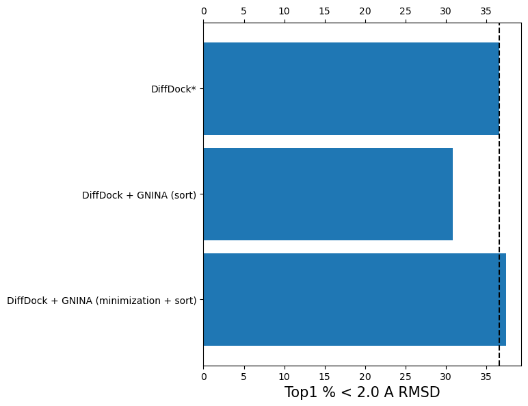

# Blind_docking

Reproducing the results of [Do Deep Learning Models Really Outperform Traditional Approaches in Molecular Docking?](https://arxiv.org/abs/2302.07134) with GNINA.

[GNINA](https://github.com/gnina/gnina) is fairly compared to DiffDock for blind docking (i.e. GNINA is used to find the ligand pose given a pocket). We find that GNINA given the DiffDock binding pocket (`DiffDock+GNINA`) can get more docked poses <2 A RMSD than DiffDock. Though we note that given the correct binding pocket (`GT pocket`) the performance of GNINA increases further, indicating that DiffDock is not finding the correct binding pocket 100% of the time. We note that the performance of `DiffDock+GNINA` is only slightly less than the reported `GT pocket + Uni-dock`. `DiffDock*` here indicates that Diffdock was retrained in the paper.


We also see a significant drop in performance of both DiffDock and GNINA when the we filter the test set for any PDB IDs that were in the training set. Though GNINA is still able to find more poses <2 A RMSD than DiffDock, the performance is significantly lower than when the test set is not filtered. We do see that the performance increase of GNINA given the DiffDock pocket is greater than the performance increase without filtering, indicating that GNINA's docking performance is more generalized than DiffDock's.


Finally, we inspect the performance of the DiffDock confidence model by utilizing the GNINA scoring function to resort the poses predicted by DiffDock. We find that the GNINA scoring function is unable to improve the performance of DiffDock, indicating that the DiffDock confidence model is as good as the GNINA scoring function. However, the GNINA scoring function is only able to correctly score the DiffDock poses after the poses have been minimized by the Vina scoring function. This indicates the DiffDock generated poses are significantly different from the GNINA CNN scoring function training poses.



## Installation

```bash
conda create -n blind_docking python==3.10 numpy 
conda activate blind_docking
conda install vina==1.2.3 -c conda-forge
pip install biopandas
```

## Example

```bash
python equi_bind_diffdock_box_vina.py
```
Then results including original output poses and RMSDs will be in the `results` folder.
